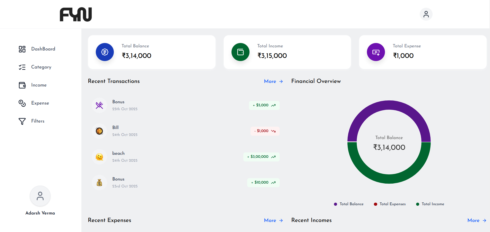
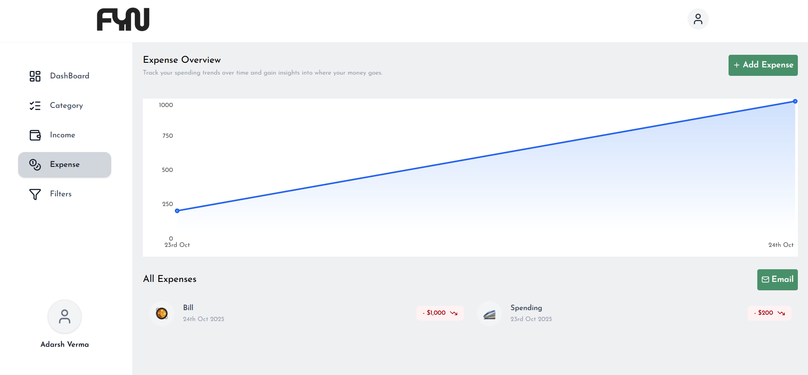

# FYN – Money Manager Application

FYN is a full-stack Money Manager application that helps users track their income, expenses, and overall financial health in a secure and intuitive interface.

---

## Live

**Live App:** [FYN Money Manager](https://fynmanager.netlify.app/)

---

## Technologies Used

**Backend :** Spring Boot, Spring Security, JWT, bcrypt, JPA, Hibernate, MySQL (Development), PostgreSQL (Production), Docker  

**Frontend :** ReactJS, ContextAPI, TailwindCSS, LucideReact, Docker  

**Tools :** Docker Compose, Node.js(for frontend), Maven, Postman  

---

## Features

- **Secure Authentication:** User login and registration using JWT and Spring Security.  
- **Income & Expense Tracking:** Add, update, and delete transactions easily.  
- **Categorization & Reports:** Visualize spending habits and monthly summaries.  
- **Responsive UI:** Built with ReactJS and TailwindCSS for smooth navigation.  
- **Global State Management:** Efficient app-wide state handling with ContextAPI.  

---

## Screenshots

  
  
  

---


## Local Setup 

### Prerequisites
- Docker & Docker Compose installed
- Node.js (for frontend, optional if use Docker(file present in the structure))

### Steps

0. **Combination**

The applicaiton is in two differnt repository you need to clone both or Zip download both and then merge them and proceed
</br>
Fyn-MoneyManager backend : [Backend_Github_Link](https://github.com/exorcist09/fyn.git)   

1. **Clone the repository**
```bash
git clone https://github.com/exorcist09/fyn.git
cd fyn
```
2. **Run Docker Compose**
```bash
docker-compose up --build
This will spin up both backend and frontend containers along with the database.
```

3. **Access the app**
```bash
Frontend: http://localhost:3000
Backend API: http://localhost:8080
```
